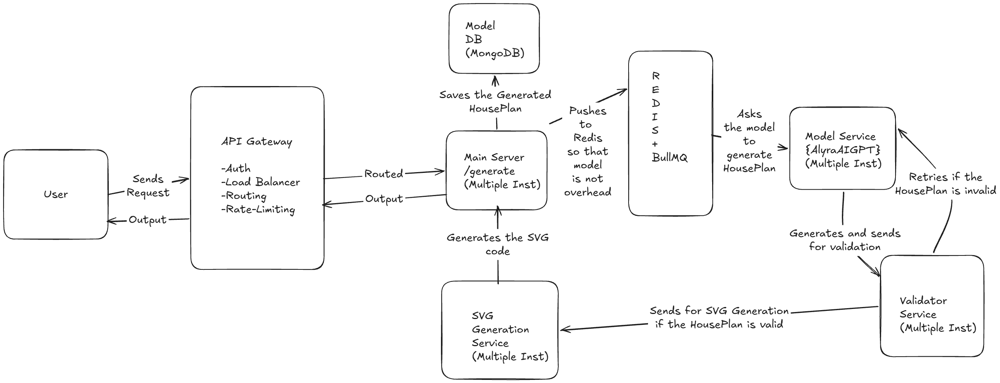
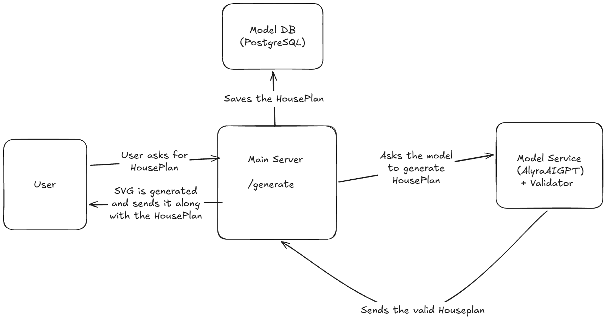
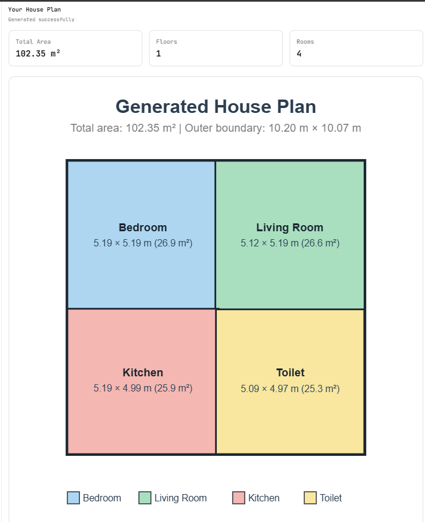
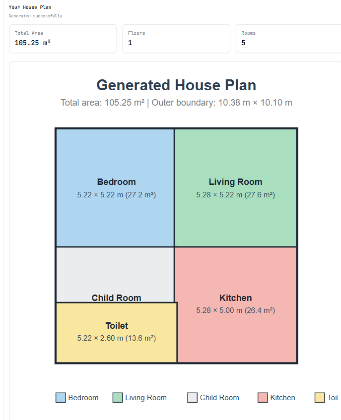
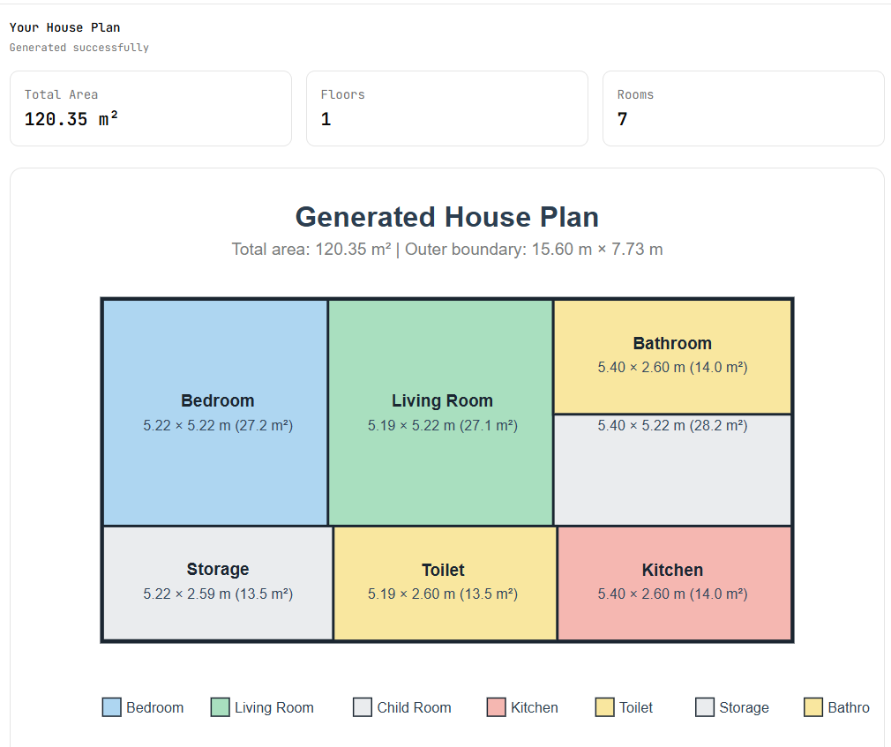
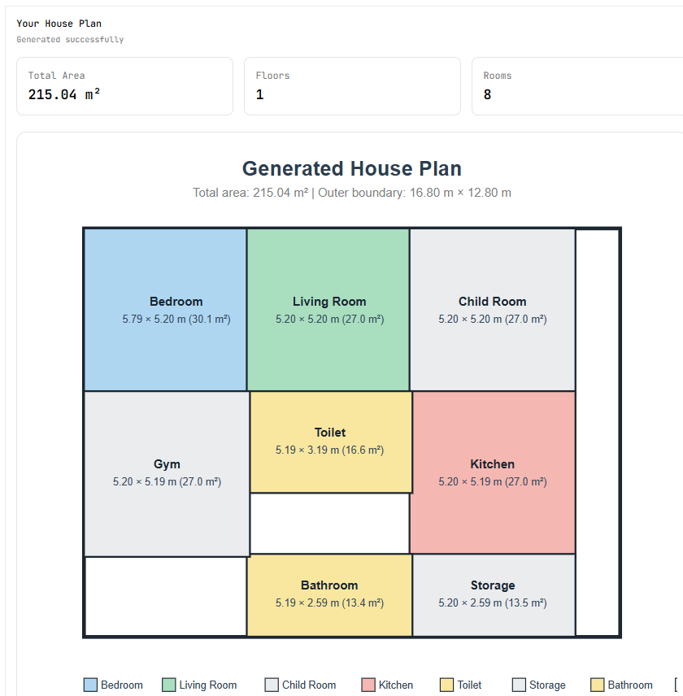

# AlyraAI

> **Generates structured house floor plans from natural-language requirements using a fine-tuned LLM.**

AlyraAI is an end-to-end AI-powered house plan generation system that converts natural-language housing requirements into **structured, coordinate-based floor plans**.
---

## Demo

### Example Input

```text
Could you design me a house with a living room, kitchen, bedroom and toilet?
```

### AI Output

The fine-tuned model generates a structured `HousePlan`:

```json
{
  "total_area": 102.354,
  "status": "normalized",
  "floors": 1,
  "floor_plan": [
    {
      "floor": 1,
      "boundary": {
        "width": 10.2,
        "height": 10.07
      },
      "rooms": [
        {
          "name": "Bedroom",
          "room_type": "Bedroom",
          "x": 0,
          "y": 0,
          "width": 5.19,
          "height": 5.19
        },
        {
          "name": "Living_Room",
          "room_type": "Living_Room",
          "x": 5.08,
          "y": 0,
          "width": 5.12,
          "height": 5.19
        },
        {
          "name": "Kitchen",
          "room_type": "Kitchen",
          "x": 0,
          "y": 5.08,
          "width": 5.19,
          "height": 4.99
        },
        {
          "name": "Toilet",
          "room_type": "Toilet",
          "x": 5.1,
          "y": 5.1,
          "width": 5.09,
          "height": 4.97
        }
      ]
    }
    "svg": "<.........">
  ]
}
```

The backend validates the geometry and converts the structured representation into an SVG floor plan that can be rendered directly in the frontend.

---

# Architecture
High Level Architecture for Production


Implemented Architecture


# Output









# How It Works!?

AlyraAI follows a multi-stage generation pipeline.

### 1. User Request

The user describes the house they want using natural language.

```text
"I need a modern house with bedrooms, a kitchen, living room and bathrooms." or "Could you help me design a house with ...?
```

### 2. Model Generation

The request is sent to the fine-tuned Qwen2.5-3B-Instruct model.

The model generates a structured `HousePlan` rather than an image.

```text
Natural Language
       ↓
AlyraAI-Qwen2.5-3B-Instruct(Fine-Tuned)
       ↓
HousePlan JSON
```

### 3. Schema Validation

The generated JSON is parsed using Pydantic.

Invalid structures are rejected before they reach the rendering layer.

### 4. Geometric Validation

The plan is checked for:

* Invalid dimensions
* Rooms outside floor boundaries
* Invalid floor numbers
* Incorrect floor count


### 5. Retry

If the generated plan is invalid, the validation errors are passed back to the generation pipeline.

The model receives information such as:

```text
Kitchen dimensions are invalid.

Generate a new HousePlan that fixes this constraint.
```

The system can retry generation rather than returning an invalid plan to the user.
The system can retry generation for the maximum of 3 times. If the plan is invalid, necessary output message is given.

### 6. SVG Rendering

Once a plan passes validation, the backend converts the coordinate-based representation into SVG.

```text
HousePlan JSON
      ↓
SVG Renderer
      ↓
SVG Floor Plan
```

The frontend can then render the SVG directly.

---

# Machine Learning

## Base Model

**Qwen/Qwen2.5-3B-Instruct**

The model was fine-tuned using **Unsloth + QLoRA** on a Google Colab T4 GPU.

Model:

**[Alyra HousePlan Qwen2.5-3B](https://huggingface.co/OxOv3rH4uL/alyra-houseplan-qwen2.5-3b)**
---

## Source Dataset
The training data was derived from the **HouseExpo** floor-plan dataset.
**[Source](https://github.com/TeaganLi/HouseExpo)**
```text
35,126 house floor plans
```

The original floor plans were transformed into instruction/response pairs.
The dataset contains natural-language requests paired with structured `HousePlan` outputs.

### Final Dataset

After generation, filtering and splitting:

```text
Total samples: 19,332 (Actually 20k+ but I couldnt find the proper out of the split(Google Colab prob))

Training:       17,398
Validation:        966
Test:              968
```

Split:

```text
90% Train
 5% Validation
 5% Test
```

Random seed:

```text
42
```

---

# Synthetic Data Generation

The original HouseExpo data provides geometric information such as:

* Room categories
* Bounding boxes
* House boundaries
* Room coordinates

This information was transformed into training examples suitable for supervised fine-tuning.

The resulting examples follow an instruction-based format:

```json
{
  "instruction": "Generate a house plan based on the user's requirements.",
  "input": "I need a house with a bedroom, kitchen and bathroom.",
  "output": "{ ... HousePlan JSON ... }"
}
```
```text
Natural-language requirements
              ↓
        Spatial structure
              ↓
       HousePlan JSON
```

---

# Fine-Tuning

A 4-bit QLoRA configuration was used to reduce GPU memory requirements.

### LoRA Configuration

```text
Rank (r):             16
LoRA Alpha:           16
LoRA Dropout:         0
RSLoRA:               Enabled
Gradient Checkpoint:  Unsloth
```

Target modules:

```text
q_proj
k_proj
v_proj
o_proj
gate_proj
up_proj
down_proj
```

### Training Configuration

```text
Epochs:                 2
Batch Size:             2
Gradient Accumulation:  16
Learning Rate:          2e-4
Scheduler:              Cosine
Warmup Ratio:           0.03
Optimizer:              AdamW 8-bit
Weight Decay:           0.01
Max Sequence Length:    1024
Packing:                Enabled
```

### Training Result

Final training loss:

```text
0.4989
```

---

# HousePlan Representation

AlyraAI does not represent a house as a generated image.

Each room is represented using spatial coordinates:

```json
{
  "name": "Bedroom",
  "room_type": "Bedroom",
  "x": 0,
  "y": 0,
  "width": 5.22,
  "height": 5.22
}
```

# Validation

A custom geometry validator checks every generated plan before it is returned.

### Boundary Validation

Ensures every room remains inside the floor boundary.

```text
x >= 0 & y >= 0
x + width <= floor_width & y + height <= floor_height
```

### Dimension Validation

Rooms must have positive dimensions.

```text
width > 0 & height > 0
```

### Floor Validation

The system verifies:

```text
Number of generated floors = Requested number of floors
```
and ensures floor numbers are valid.

(There are many edge cases but our model can handle these as of now)

# Technology Stack

## AI / Machine Learning
* Python
* PyTorch
* Hugging Face Transformers
* Qwen2.5-3B-Instruct
* Unsloth
* QLoRA
* PEFT

## Backend

* Python
* FastAPI
* Pydantic
* SQLAlchemy
* PostgreSQL

## Distributed Processing (Synthetic Dataset Generation)

* Redis
* BullMQ
* Node.js

## Frontend

* Next.js
* React
* TypeScript
* ShadCN UI
* Axios

## Rendering

* SVG
* Python-based rendering service

## Infrastructure / Tools

* Git
* GitHub
* Hugging Face
* Google Colab
---

